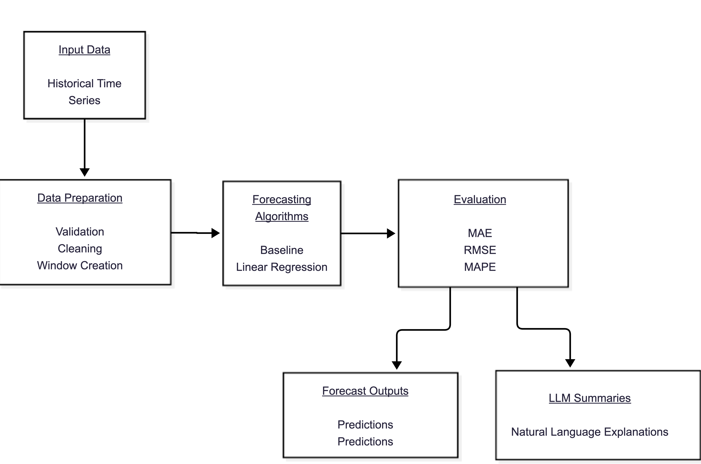

# Summary

Urban Forecast is an open-source Python library designed to predict fill levels in smart waste bins using IoT sensor data. The project provides a lightweight and interpretable forecasting pipeline focused on smart city environments and urban waste management optimization.

The system was developed as part of an ongoing master's research project in the "Programa de Pós-Graduação em Ciência da Computação (PPG-CC)" at Universidade Federal de São Paulo (UNIFESP).

The architecture integrates embedded devices based on ESP8266 microcontrollers [@esp8266] and ultrasonic sensors capable of monitoring waste levels in real time. Sensor measurements are transmitted to a Supabase database [@supabase] and processed by Urban Forecast to estimate future fill levels and support smart waste collection decisions.

The generated predictions can support waste collection route optimization, reduction of operational costs, prevention of overflow events, and more efficient allocation of collection resources.

# Statement of need

Traditional urban waste collection systems commonly operate using static collection schedules, regardless of the actual fill level of waste bins. This approach often results in inefficient routes, unnecessary fuel consumption, increased operational costs, and delayed collection in high-demand areas [@abdallah2019].

Recent advances in IoT technologies enable the deployment of smart bins capable of continuously transmitting fill-level measurements. However, converting raw sensor measurements into actionable predictive insights remains a challenge for municipalities, researchers, and smart city initiatives.

Many forecasting approaches for IoT applications rely on machine learning models and deployment architectures that can impose significant computational and operational requirements, limiting their suitability for lightweight embedded monitoring systems [@ahmed2022].

Urban Forecast addresses this problem by providing a lightweight and modular framework for time-series forecasting in smart waste management environments. The framework combines forecasting algorithms, configurable prediction pipelines, and interpretable outputs that support operational decision-making. It is designed for straightforward integration with IoT-based monitoring infrastructures and can optionally generate natural language summaries of prediction results using Large Language Models (LLMs) [@llama2023].

The software is particularly relevant for applications in smart city research, urban analytics, IoT monitoring systems, and waste management optimization. In addition, its accessible architecture makes it suitable for educational and academic environments, where forecasting methods and smart city technologies can be explored and evaluated.

Urban Forecast contributes to the field by offering a forecasting framework specifically tailored to smart waste monitoring scenarios. The project emphasizes lightweight and interpretable forecasting strategies that can operate in resource-constrained environments while integrating IoT sensing, cloud-based data persistence, and AI-assisted explainability within a unified architecture. This combination enables rapid experimentation, reproducible research, and practical deployment in smart city applications.

# State of the field

Smart waste management systems have become an important research topic within smart city initiatives [@iot2019]. Several IoT-based architectures have been proposed for monitoring urban waste containers using sensors, wireless communication, and cloud-based infrastructures [@smartCities].

Many existing systems focus primarily on data collection and monitoring dashboards while offering limited predictive capabilities. Forecasting future fill levels can significantly improve route optimization and collection efficiency, especially in large urban environments.

Machine learning and time-series forecasting approaches have been explored in urban monitoring applications, but many solutions require complex infrastructures or rely on computationally expensive models that are difficult to deploy in resource-constrained environments.

Urban Forecast focuses on providing a lightweight, modular, and easy-to-integrate forecasting pipeline suitable for both academic research and practical IoT deployments. The software emphasizes interpretability, simplicity, and ease of integration with cloud-based architectures such as Supabase.

Unlike many existing smart waste management solutions that prioritize dashboard visualization or complex deep learning architectures,
Urban Forecast focuses on lightweight and interpretable forecasting approaches that can be easily deployed in IoT scenarios with limited computational resources.

# Software design

Urban Forecast was designed using a modular architecture to facilitate experimentation with different forecasting strategies and integration with external systems.

The software receives historical time-series data, performs data preparation and forecasting, evaluates prediction quality using standard forecasting metrics, and can optionally generate natural language summaries through LLM integration.



The framework is organized into modular components:

- `baseline.py`: heuristic forecasting model;
- `regression.py`: linear regression forecasting model;
- `pipeline.py`: unified execution pipeline;
- `ia.py`: LLM-based explanation generation;
- `api/`: REST API integration layer.

Urban Forecast currently implements two lightweight forecasting approaches designed for smart waste monitoring scenarios. The selected methods represent different forecasting strategies while maintaining low computational requirements and straightforward interpretability, characteristics that are particularly important in IoT-based environments.

The forecasting workflow consists of collecting fill-level measurements from ultrasonic sensors, storing the data in Supabase, preprocessing historical observations, applying forecasting models, and optionally generating natural language summaries through LLM integration.


## Baseline Average Rate Model

The Baseline Average Rate model is a heuristic forecasting approach that estimates future fill levels based on the recent rate of change observed in historical measurements. The method assumes that the short-term filling behavior of a waste bin can be approximated by its most recent filling trend, making it suitable for scenarios where computational simplicity and rapid execution are required [@hyndman2021].

Because the model relies on straightforward calculations rather than parameter optimization or model training, it presents a low computational overhead and can be applied in resource-constrained environments. In addition, its transparent formulation facilitates interpretation of the generated forecasts and supports practical deployment in IoT-based monitoring systems.

## Linear Regression Model

The Linear Regression model estimates future fill levels by fitting a linear relationship between time and observed fill percentages [@james2021]. This approach captures long-term filling tendencies and provides a simple statistical framework for forecasting when waste accumulation follows an approximately linear trend.

Compared to purely heuristic approaches, linear regression can produce smoother forecasts and reduce the influence of short-term fluctuations or noisy sensor measurements. The model remains computationally efficient while providing a more formal representation of temporal trends, making it suitable for exploratory forecasting studies and smart waste monitoring applications.

# Evaluation metrics

Urban Forecast supports commonly used forecasting metrics for evaluating prediction quality and comparing forecasting strategies.

The current implementation supports:

- Mean Absolute Error (MAE), which measures the average magnitude of prediction errors;
- Root Mean Squared Error (RMSE), which penalizes larger prediction deviations more strongly;
- Mean Absolute Percentage Error (MAPE), which measures prediction error relative to the observed values.

These metrics allow quantitative evaluation of forecasting accuracy in smart waste monitoring scenarios and support comparison between heuristic and regression-based approaches [@hyndman2006].


# Experimental evaluation

The experimental evaluation was conducted using real-world fill-level measurements collected from IoT-enabled smart waste bins connected through ESP8266 microcontrollers and ultrasonic sensors.

Historical sensor measurements were retrieved from the Supabase-based data infrastructure used in the associated research project. The evaluation focused on estimating the remaining time until waste bins reached a predefined fill threshold.

The forecasting approaches were evaluated using the metrics supported by Urban Forecast, including MAE, RMSE, and MAPE [@hyndman2006].

Table 1 summarizes the global forecasting performance of the evaluated models, showing comparable error levels across MAE, RMSE, and MAPE metrics.

| Model      | MAE   | RMSE  | MAPE  |
| ---------- | ----- | ----- | ----- |
| Baseline   | 2.553 | 3.222 | 0.248 |
| Regression | 2.588 | 3.306 | 0.244 |

The evaluated forecasting approaches achieved comparable performance levels during the experimental evaluation [@willmott2005]. The heuristic baseline model presented slightly lower MAE and RMSE values, while the regression-based approach achieved a marginally lower MAPE value.

The obtained results indicate that lightweight forecasting approaches can provide useful predictive estimates for smart waste monitoring scenarios without requiring computationally expensive machine learning models or complex deployment infrastructures.

Table 2 presents the forecasting performance across individual monitored sensors.

| Sensor     | Model      | MAE   | RMSE  | MAPE  |
| ---------- | ---------- | ----- | ----- | ----- |
| A1 | Baseline   | 2.462 | 2.933 | 0.319 |
| A1 | Regression | 2.288 | 2.799 | 0.288 |
| A2 | Baseline   | 2.392 | 3.165 | 0.239 |
| A2 | Regression | 2.498 | 3.310 | 0.246 |
| A3 | Baseline   | 2.805 | 3.537 | 0.187 |
| A3 | Regression | 2.977 | 3.743 | 0.196 |

The per-sensor evaluation demonstrates that the forecasting approaches maintain relatively stable performance across different monitored waste bins. Small variations between sensors are expected due to distinct fill-rate behaviors, environmental conditions, and usage patterns.

Figure 1 presents the relationship between predicted and real remaining time values for both evaluated forecasting approaches.


Most predictions remained close to the ideal prediction line, demonstrating reasonable agreement between predicted and observed remaining time values under real IoT monitoring conditions [@chai2014].

Additional experimental artifacts, including generated CSV reports, benchmark scripts, and visualization outputs, are publicly available in the project repository to support reproducibility and transparency.


# AI-assisted explainability

Urban Forecast optionally integrates Large Language Models (LLMs) through the Groq API to automatically generate natural language summaries of the forecasting results. This capability translates numerical outputs, forecast trends, and estimated filling trajectories into concise textual explanations that can be more easily interpreted by non-technical users.

The explainability layer is designed to complement quantitative forecasting metrics rather than replace them. By providing human-readable descriptions of predicted waste accumulation patterns, the system can support operational decision-making and facilitate communication between technical and administrative stakeholders.

This functionality is particularly useful in smart city environments, where waste management operators may benefit from rapid interpretation of forecasting outputs without requiring expertise in time-series analysis or statistical modeling. The integration leverages the Groq platform for low-latency inference and access to modern LLMs, enabling real-time generation of explanatory summaries [@groq2024].


# Research impact statement

Urban Forecast is currently being used as part of an ongoing master's research project focused on smart waste collection systems based on IoT infrastructure and cloud computing.

The project contributes to smart city research by combining embedded IoT sensing, cloud-based data persistence, lightweight forecasting models, and AI-assisted explainability within a unified framework.

The modular design allows the software to be adapted for educational purposes, research experiments, and real-world urban monitoring systems.

The software is currently being integrated into an experimental smart
waste monitoring infrastructure developed during the author's master's
research project.

# Example usage

```python
from urban_forecast.pipeline import run_pipeline
import pandas as pd

df = pd.DataFrame({
    "created_at": pd.date_range(
        start="2024-01-01",
        periods=10,
        freq="H"
    ),
    "fill_percent": [10,15,20,25,30,35,40,45,50,55]
})

result = run_pipeline(df)

print(result)
```

# AI usage disclosure
All technical content, software implementation details, experimental results, and project information presented in this manuscript were produced, reviewed, and validated by the author.

# Acknowledgements
The author thanks the Programa de Pós-Graduação em Ciência da Computação (PPG-CC) and Universidade Federal de São Paulo (UNIFESP) for supporting the associated research project.

# References
